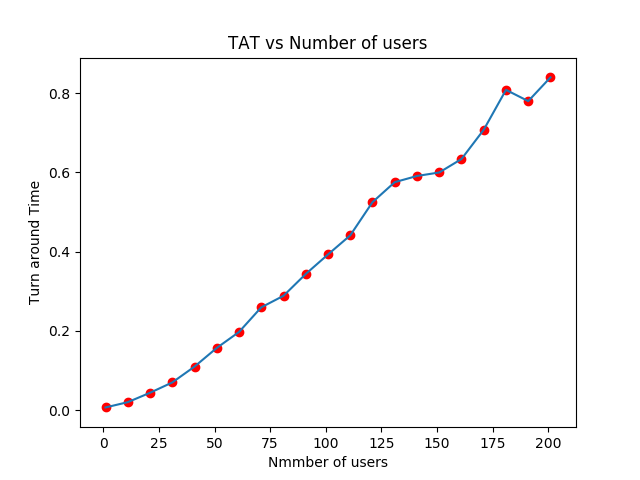

# CGame

A Tic Tac Toe Game built on C Webserver Powered By Javascript WebSockets and A WebSocket Server Built on C++.

## Phase 1 Building the Application 

 

## Phase 2 Load Testing the Application

 

